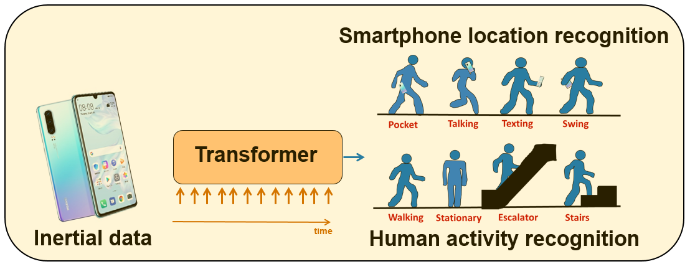

## Inertial-based Activity Recognition with Transformers 
This repository gives the official PyTorch implementation of the IMU-CNN and IMU-Transformer models from the paper: "Boosting Inertial-based Human Activity Recognition with Transformers" (Shavit and Klein, 2021, IEEE Open Access). 

We propose general framework for inertial-based activity recognition with Transformers. 
Samples collected over time with inertial sensors on mobile devices are provided to a Transformer Encoder architecture for learning smartphone location recognition and human activity recognition tasks. The proposed approach is the first to employ Transformers for this task and is shown to provide a consistent improvement, across multiple datasets and scenarios.  

Our model architecture (IMU-Transformer) is shown below:


### Training and Testing for Intertial-based Activity Recognition
This repository supports the training and testing of deep learning models for intertial-based activity recognition.
Specifically these models take IMU data and classify the activity class. 
We support two models: 
- A Transformer-based classifier (IMU-Transformer). This is our proposed architecture, described in out paper
- A CNN-based (IMU-CNN) classifier, provided for comparison purposes

The entry point to our framework is the script ```main.py```
The frameworks takes in a .csv file, where each row includes a single sample and its associated class.
The samples are then aggregated according to the window size specified in the configuration file.

In order to train a model run:
```
main.py train <path to labels file> 
```
During training, the models and log file will be saved to a dedicated output folder (created if does not exist)
In order to test a trained model:
```
main.py train <path to imu dataset .csv file> --checkpoint_path <path to your model>
```
In order to see the full options:
```
main.py -h
```
The different hyperparameters, including whether to run the Transformer/CNN architectures are controlled by 
the configuration file (```config.json```)

### Configuration Parameters
Parameter Name | Description |
--- | --- |
n_freq_print|How often to print the loss to the log file
n_freq_checkpoint|How often to save a checkpoint
n_workers|Number of works
device_id|The identifier of the torch device (e.g., cuda:0)
input_dim|The dimension of the input IMU data, e.g. 6 when using accelerometers and gyros
window_size|The size of the time window (i.e. how many samples in a window)
num_classes|Number of classes
window_shift|The window shift, put here the window_size to avoid window overlap
use_baseline|Whether to use the CNN-baseline or not (setting this to False will train the Transformer-based model)
encode_position|Whether to encode positions for IMU-Transformer
transformer_dim|The latent dimension of the Transformer Encoder
nhead|Number of heads for the MHA operation
num_encoder_layers| Number of encoder layers (Transformer)
dim_feedforward:| The latent dimension of the Encoder's MLP
transformer_dropout| The dropout applied to the Transformer
transformer_activation| Activation function used for the Transformer (gelu/relu/elu)
head_activation|Activation function used for the MLP classifier head 
baseline_dropout|Dropout applied for the CNN baseline model 
batch_size| The batch size
lr|The learning rate
weight_decay|The weight decay 
eps| epsilon for Adam optimizer
lr_scheduler_step_size|How often to decay the learning rate
lr_scheduler_gamma|By what factor to decay the learning rate
n_epochs|Number of epochs

